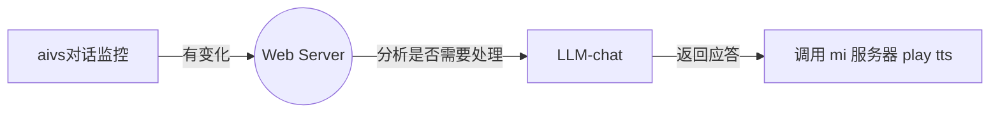

# 自主控制音箱的步骤

1. [保留目前所有服务, 只替换 LLM-chat, 使用原生的 vad + kws + asr + tts](#step-1)
2. 使用自己的 asr, LLM-chat 以及 tts, 使用原生的 vad + kws
3. 完全替换

## 一些名词解释

### LLM-chat

大语言模型的 chat 版本, 通俗的理解就是 ChatGPT, 文心一言, kimi-chat 等

### VAD

语音活动检测 (Voice Activity Detection), 可以认为是对外边声音的一轮粗筛, 有人说话才继续后面的分析

### KWS

唤醒词检测 (Keyword Spotting), 就是我们喊 "Hey siri", "小爱同学" 的时候, 用这个东西检测到  
(猜测小爱音箱里的 vad 和 kws 都是用的 [kaldi](https://github.com/kaldi-asr/kaldi), 因为 kaldi 之父 Daniel Povey 现在在小米)

后面如果要做完全替换, 最容易上手的应该是 [Porcupine](https://github.com/Picovoice/porcupine), 他的 2.0 版本之前是完全随便用, 2.0以及之后需要用 token  
如果 1.9 够用就用, 不够用可能就得研究 kaldi 了

### ASR

自动语音识别 (Automatic Speech Recognition) 把声音转成文字  
完全替换的话可能会用 [Paddle speech](https://github.com/PaddlePaddle/PaddleSpeech)

### TTS

文本转语音 (Text to Speech), 就是把文字念出来, 平时抖音上常听到的那些语音, 很多都是用的微软的 tts 服务生成出来的 ("那个男人叫小帅")  
完全替换可能顺便就用 Paddle speech, 或者微软的免费款 tts, 或者其他一些开源的, 比如 [评述味道的tts](https://github.com/X-LANCE/StoryTTS)

## step 1

替换 LLM-chat 的核心就是: 监控交互 + mute原生相应 + 使用自定义 LLM-chat 进行 tts 播放  
做完之后的效果和著名的 [xiaogpt](https://github.com/yihong0618/xiaogpt) 效果一样, 优点是 "不用轮训云服务的 api 获取对话记录", 缺点是:
- 需要 "root" 音箱, 刷自己的固件进去
- 需要开发一个运行在音箱里的监控程序, 把对话记录实时发出来

本 Step 具体分以下步骤

- [x] 刷机方法参考主页 [README](../README.md)
- [x] 监控对话记录并发送出来的 [aivs-monitor](../src/apps/aivs-monitor/)
    - [X] 监控和发送
    - [ ] mute 原生应答
    - [ ] 支持 Server 配置
- [ ] 配合的 [Web Server](../src/server/)
    - [x] 接收对话消息交给 LLM 生成应答
    - [x] 支持 Github Copilot 生成应答 (不用额外买GPT服务了)
    - [ ] 调用小米服务器或者音箱服务播放应答

