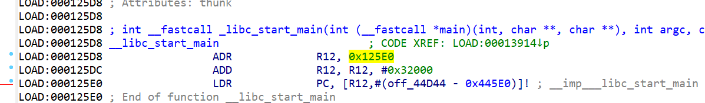
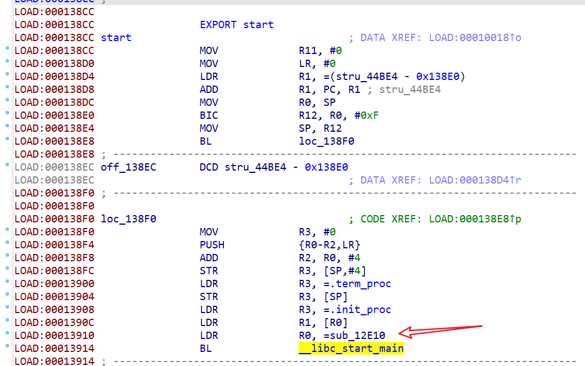
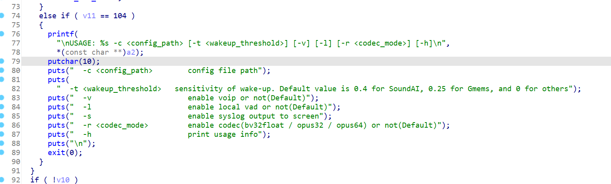
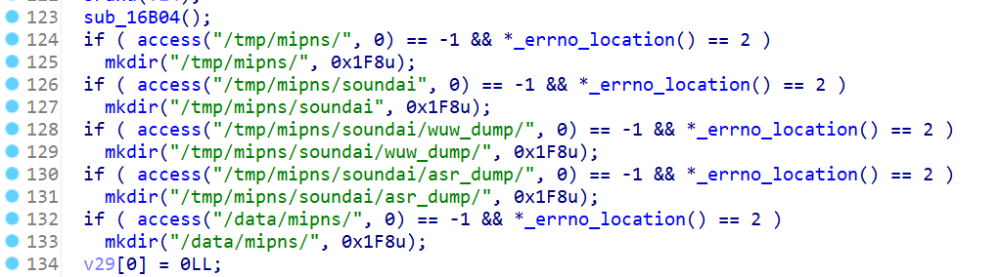
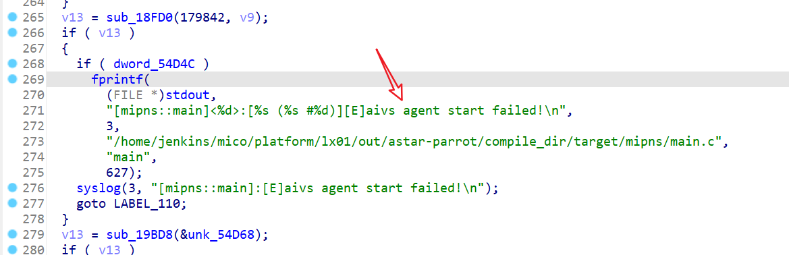
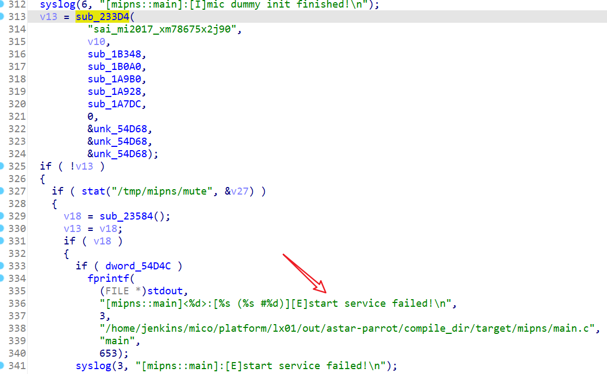
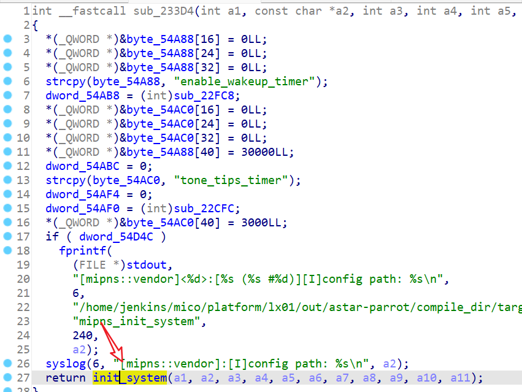

# 如何了解某个进程是做什么的

以 `mipns-sai` 为例

## 粗略信息

1. 查看它依赖了哪些 so

```sh
root@LX01:~# ldd /usr/bin/mipns-sai
        /lib/ld-musl-armhf.so.1 (0xb6ede000)
        libsai_miAPIs.so => /usr/lib/libsai_miAPIs.so (0xb6ddf000)
        libmdspeech.so => /usr/lib/libmdspeech.so (0xb6d78000)
        libiotdcm.so => /usr/lib/libiotdcm.so (0xb6bdd000)
        libaivs-message-util.so => /usr/lib/libaivs-message-util.so (0xb6bc3000)
        libubox.so => /lib/libubox.so (0xb6baa000)
        libubus.so => /lib/libubus.so (0xb6b94000)
        libjson-c.so.2 => /usr/lib/libjson-c.so.2 (0xb6b7b000)
        libasound.so.2 => /usr/lib/libasound.so.2 (0xb6ac0000)
        libmico-common.so => /usr/lib/libmico-common.so (0xb6a8c000)
        libgcc_s.so.1 => /lib/libgcc_s.so.1 (0xb6a72000)
        libc.so => /lib/ld-musl-armhf.so.1 (0xb6ede000)
        libcrypto.so.1.0.0 => /usr/lib/libcrypto.so.1.0.0 (0xb693a000)
        libstdc++.so.6 => /lib/libstdc++.so.6 (0xb6837000)
        libprotobuf-c.so.1 => /usr/lib/libprotobuf-c.so.1 (0xb6821000)
        libopus.so.0 => /usr/lib/libopus.so.0 (0xb67d7000)
        libz.so.1 => /usr/lib/libz.so.1 (0xb67b5000)
        libblobmsg_json.so => /lib/libblobmsg_json.so (0xb67a2000)
        libconfig.so.11 => /usr/lib/libconfig.so.11 (0xb6788000)
        libuuid.so.1 => /usr/lib/libuuid.so.1 (0xb6774000)
        libcurl.so.4 => /usr/lib/libcurl.so.4 (0xb6723000)
        libwpa_client.so => /usr/lib/libwpa_client.so (0xb670b000)
        libsha1.so => /usr/lib/libsha1.so (0xb66f6000)
        libiconv.so.2 => /usr/lib/libiconv.so.2 (0xb66aa000)
        libcares.so.2 => /usr/lib/libcares.so.2 (0xb668b000)
        libnghttp2.so.14 => /usr/lib/libnghttp2.so.14 (0xb665f000)
        libssl.so.1.0.0 => /usr/lib/libssl.so.1.0.0 (0xb6609000)
root@LX01:~# 
```

2. strace 启动看看 (不知道为啥这么局促的存储里边居然塞了 strace)

    `strace /usr/bin/mipns-sai -c /tmp/mipns/soundai/config -l`
    
    输出太多, 这里省略掉, 可以看到它:
    - 读了 `/tmp/mipns/soundai/config/` 下的一大堆配置文件
    - 创建了 `pnshelper.fifo`
    - 创建并bind了 `usock/speech.usock`
    - init 了 pcm 设备

## 进一步查看

使用 IDA 进行反编译, 参考 [如何传输文件](./file-transferring.md#如何在音箱和-pc-之间传送文件) 把这个 binary 拷贝到电脑上来, 用 IDA 打开

首先我们要找到入口函数, 

1. 直接在 Function name 窗口搜索 main, 能看到 `__libc_start_main`, 这个是 C 语言程序启动的入口点, 选中函数名字鼠标右键菜单 "Jump to xref to operand" 或者快捷键 `X` 来查找函数的引用, 能看到 start 这个函数
    

    另外也可以通过 `objdump` 直接拿到入口地址(也就是这个 start 的地址), 在 IDA 中 `G` 到这个地址就是了 (得在 arm 上执行或者使用 target=arm 的 x86 上的 objdump 执行)

    (项目中的 [交叉编译环境镜像](../src/cross-build-env/) 编译出来的工具做示例)  
    同样能拿到 `0x000138cc` 这个地址

```shell
$ armv7l-linux-musleabihf-objdump -f mipns-sai 

mipns-sai:     file format elf32-littlearm
architecture: armv3m, flags 0x00000102:
EXEC_P, D_PAGED
start address 0x000138cc
```


2. 在 ARM 体系中传参和返回值一般遵循下边逻辑:

    参数传递：
    - 前四个参数（如果存在）通过寄存器r0到r3传递。
    - 当有超过四个参数时，就需要将剩余的参数压入栈中。
    - 当参数是复杂的数据类型或者大于4字节的数据类型时，必须要将它们在栈上存储，并将栈的地址作为参数，要确保栈对8字节对齐。

    返回值：
    - 通过寄存器 r0 返回。

    而传递给 `__libc_start_main` 的参数就是用户 `main` 函数地址, 就是 `sub_12E10` 这个函数

    

3. 看 main 函数干了啥

    (如果你的 IDA 中没有 Hex-Rays 的 ARM Decompiler 可以查看伪码, 可能分析过程耗时会比较长)

    前面一大堆启动参数解析, 对我们来讲最重要的就是 `-s` 参数 (可以直接加 -s 参数启动一下 mipns-sai, 可以看到好多有用的信息)

    

    和前面 strace 看到的逻辑一样, 摸 config 目录, 创建一些文件

    

    这个函数从 debug 日志可以看出叫做 aivs_agent_start, 这个是很重要的一个函数, 是和 `mico_aivs_lib` 这个进程交互的

    

    然后就是最重要的部分 `init_system & start_service`

    
    

    到了 `init_system` 里边之后就没办法继续跳了, 因为这个函数不是在这个 bin 里实现的, 要找到是哪个 so 实现了这个函数, 最粗暴的方法就是 foreach ldd 看到的 so, 然后 `strings libxxx.so | grep init_system` 就可以找到了 (如果是bin里懒加载 so, 在 IDA 的 strings 是可以搜到的这个调用的, 应该更加简单) 


## tips

- 善用 IDA 的快捷键, 比如 `X / G / N` 等
- 把分析好的函数或者本地变量都及时重名成友好的名称, 把伪码过一遍并且重命名之后, 程序实现方式一目了然